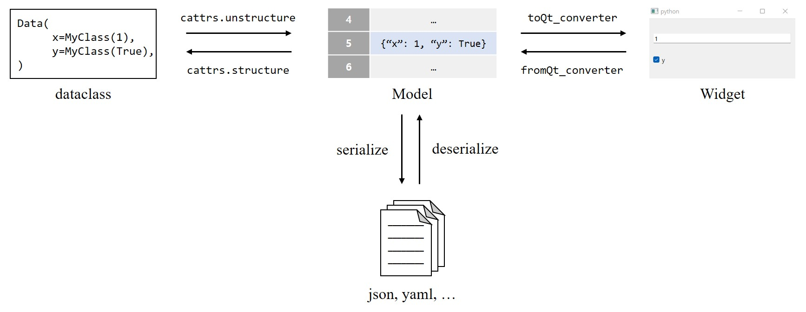

.. _construct-dataclass:

===============================
Constructing dataclass instance
===============================

.. currentmodule:: cattrs

In :ref:`data-model` document, we learned how to store the widget data into the model.
Here, we will construct the dataclass instance from the model data.

Constructing nested dataclass
=============================

First we define a complicated, nested dataclass.

>>> import dataclasses
>>> from typing import Tuple, Optional
>>> @dataclasses.dataclass
... class Inner:
...     x: int
>>> @dataclasses.dataclass
... class DataClass:
...     a: Tuple[Optional[int], Optional[int]] = dataclasses.field(
...         metadata=dict(Qt_typehint=Tuple[int, int]),
...     )
...     b: Inner

The nested dataclass can be unstructured by :func:`dataclasses.asdict`, but there is no standard way to restructure the dataclass from the dictionary.

>>> dcls = DataClass((None, 2), Inner(3))
>>> dcls
DataClass(a=(None, 2), b=Inner(x=3))
>>> args = dataclasses.asdict(dcls)
>>> args
{'a': (None, 2), 'b': {'x': 3}}
>>> DataClass(**args)  # inner dataclass not reconstructed
DataClass(a=(None, 2), b={'x': 3})

There are many third-party packages to resolve this.
Here, we use `cattrs <https://pypi.org/project/cattrs/1.5.0/>`_ package which supports nested reconstructions and converters.

>>> import cattrs
>>> cattrs.structure(args, DataClass)  # inner dataclass successfully reconstructed
DataClass(a=(None, 2), b=Inner(x=3))

Dataclass converter
===================

:mod:`cattrs` provides :class:`.Converter` where the hooks can be registered to structure and to unstructure the dataclass instance.

This can be useful if you want to maintain the data as primitive types in the model, and structure it when necessary.
With this design, you can serialize and deserialize the data directly from the model.

   Workflow using :mod:`cattrs`

For detailed information, refer to `cattrs documentation <https://cattrs.readthedocs.io/en/stable/index.html>`_.
