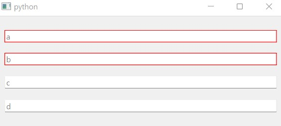

================================
Optional field and default value
================================

.. currentmodule:: dawiq

For a dataclass field, two important questions arise:

1. It is ``Optional``?
2. Does it have a default value?

If the field type is ``Optional``, :obj:`None` is allowed for placeholder object in addition to the main type.
And if there is default value, the field is not mandatory i.e. its data does not need to be passed. In such case the default value is used.

Basic example
=============

Here is a simple dataclass with differnt fields; *optional or not* and *default or not*.

>>> import dataclasses
>>> from typing import Optional
>>> @dataclasses.dataclass
... class DataClass:
...     a: int
...     b: Optional[int]
...     c: int = 0
...     d: Optional[int] = None
>>> DataClass(1)
Traceback (most recent call last):
...
TypeError: __init__() missing 1 required positional argument: 'b'
>>> DataClass(1, None)
DataClass(a=1, b=None, c=0, d=None)

``DataClass.b`` can have ``None`` value but the field is mandatory. On the other hand, ``DataClass.c`` is not mandatory but it should not be ``None``.

.. note::
    In fact, Python does not perform type check and allows you to pass ``None`` to ``DataClass.c``.
    However this shouldn't be performed for robust typing.

How will the data widget from ``DataClass`` be?

.. tabs::

    .. code-tab:: python
        :caption: PySide6

        from PySide6.QtGui import QStandardItemModel, QStandardItem
        from PySide6.QtWidgets import QApplication
        from dawiq import DataclassDelegate, DataclassMapper, dataclass2Widget
        import sys

        model = QStandardItemModel()
        item = QStandardItem()
        item.setData(DataClass, role=DataclassDelegate.TypeRole)
        model.appendRow(item)

        delegate = DataclassDelegate()
        mapper = DataclassMapper()
        mapper.setItemDelegate(delegate)
        mapper.setModel(model)

        app = QApplication(sys.argv)
        app.setStyleSheet("*[requiresFieldData=true]{border: 1px solid red}")

        widget = dataclass2Widget(DataClass)
        mapper.addMapping(widget, 0)
        mapper.setCurrentIndex(0)

        widget.show()
        app.exec()
        app.quit()

    .. code-tab:: python
        :caption: PyQt6

        from PyQt6.QtGui import QStandardItemModel, QStandardItem
        from PyQt6.QtWidgets import QApplication
        from dawiq import DataclassDelegate, DataclassMapper, dataclass2Widget
        import sys

        model = QStandardItemModel()
        item = QStandardItem()
        item.setData(DataClass, role=DataclassDelegate.TypeRole)
        model.appendRow(item)

        delegate = DataclassDelegate()
        mapper = DataclassMapper()
        mapper.setItemDelegate(delegate)
        mapper.setModel(model)

        app = QApplication(sys.argv)
        app.setStyleSheet("*[requiresFieldData=true]{border: 1px solid red}")

        widget = dataclass2Widget(DataClass)
        mapper.addMapping(widget, 0)
        mapper.setCurrentIndex(0)

        widget.show()
        app.exec()
        app.quit()

    .. code-tab:: python
        :caption: PySide2

        from PySide2.QtGui import QStandardItemModel, QStandardItem
        from PySide2.QtWidgets import QApplication
        from dawiq import DataclassDelegate, DataclassMapper, dataclass2Widget
        import sys

        model = QStandardItemModel()
        item = QStandardItem()
        item.setData(DataClass, role=DataclassDelegate.TypeRole)
        model.appendRow(item)

        delegate = DataclassDelegate()
        mapper = DataclassMapper()
        mapper.setItemDelegate(delegate)
        mapper.setModel(model)

        app = QApplication(sys.argv)
        app.setStyleSheet("*[requiresFieldData=true]{border: 1px solid red}")

        widget = dataclass2Widget(DataClass)
        mapper.addMapping(widget, 0)
        mapper.setCurrentIndex(0)

        widget.show()
        app.exec_()
        app.quit()

    .. code-tab:: python
        :caption: PyQt5

        from PyQt5.QtGui import QStandardItemModel, QStandardItem
        from PyQt5.QtWidgets import QApplication
        from dawiq import DataclassDelegate, DataclassMapper, dataclass2Widget
        import sys

        model = QStandardItemModel()
        item = QStandardItem()
        item.setData(DataClass, role=DataclassDelegate.TypeRole)
        model.appendRow(item)

        delegate = DataclassDelegate()
        mapper = DataclassMapper()
        mapper.setItemDelegate(delegate)
        mapper.setModel(model)

        app = QApplication(sys.argv)
        app.setStyleSheet("*[requiresFieldData=true]{border: 1px solid red}")

        widget = dataclass2Widget(DataClass)
        mapper.addMapping(widget, 0)
        mapper.setCurrentIndex(0)

        widget.show()
        app.exec()
        app.quit()

   Widget from ``DataClass``

We can see that the default values have nothing to do with the widget value and thus the editors are all empty.
However if a field does not have a default value, the delegate marks the widget to indicate that it should not be empty and the style sheet highlights it.

What about the widget data and the model data?

>>> widget.dataValue()  # doctest: +SKIP
{'a': None, 'b': None, 'c': None, 'd': None}
>>> item.data(role=DataclassDelegate.DataRole)  # doctest: +SKIP
{}

Data values of all widgets are ``None``, as ``None`` is designed to be.
When setting the widget data to the model data, the delegate ignores the field with ``None``.
Therefore the model data is an empty dictionary.

Now let's change the widget data to update the model data.

>>> widget.setDataValue(dict(a=3, b=4, d=5))  # doctest: +SKIP
>>> mapper.submit()  # doctest: +SKIP
>>> widget.dataValue()  # doctest: +SKIP
{'a': 3, 'b': 4, 'c': None, 'd': 6}
>>> item.data(role=DataclassDelegate.DataRole)  # doctest: +SKIP
{'a': 3, 'b': 4, 'd': 5}

Valid data (not None) in the field widget is updated to the model as well.
At this time it is easy to construct the dataclass instance from the model data.

>>> args = item.data(role=DataclassDelegate.DataRole)  # doctest: +SKIP
>>> DataClass(**args)  # doctest: +SKIP
DataClass(a=3, b=4, c=0, d=None)

We can see that ``DataClass.c`` does not exist in the model data so the dataclass constructor used the default value instead.

Limitation
----------

Now if we want to set ``None`` to ``DataClass.d``, we can just delete the field widget data.
Then the field data in the model will be deleted and dataclass constructor will use the default value, which is ``None``.

>>> widget.setDataValue(dict(a=3, b=4))  # doctest: +SKIP
>>> mapper.submit()  # doctest: +SKIP
>>> args = item.data(role=DataclassDelegate.DataRole)  # doctest: +SKIP
>>> DataClass(**args)  # doctest: +SKIP
DataClass(a=3, b=4, c=0, d=None)

But how can we set ``None`` to ``DataClass.b``?

>>> widget.setDataValue(dict(a=3))  # doctest: +SKIP
>>> mapper.submit()  # doctest: +SKIP
>>> widget.dataValue()  # doctest: +SKIP
{'a': 3, 'b': None, 'c': None, 'd': None}
>>> args = item.data(role=DataclassDelegate.DataRole)  # doctest: +SKIP
>>> args  # doctest: +SKIP
{'a': 3}
>>> DataClass(**args)  # doctest: +SKIP
Traceback (most recent call last):
...
TypeError: __init__() missing 1 required positional argument: 'b'

Sadly, we can't because ``None`` is reserved to indicate the empty widget value.
It cannot be a valid value which is updated to the model data.

This is the limitation of DaWiQ and in fact is an intended behavior.
It is because defining a dedicated sentinel object makes things ugly when we serialize the data or construct nested dataclass.

Workaround
----------

We can avoid this problem by using the widget data converter explained in :ref:`data-model`.
Let's redefine the dataclass as follows and run the GUI construction code in the basic example section above.

>>> import dataclasses
>>> from typing import Optional
>>> def fromQt_converter(string):
...     if not string:
...         return None
...     return int(string)
>>> def toQt_converter(obj):
...     if obj is None:
...         return ""
...     return str(obj)
>>> @dataclasses.dataclass
... class DataClass:
...     x: Optional[int] = dataclasses.field(metadata=dict(
...         Qt_typehint=str,
...         fromQt_converter=fromQt_converter,
...         toQt_converter=toQt_converter
...     ))

Since the data value of :class:`.StrLineEdit` is an empty string and never ``None``, we can handle the empty string to return ``None``.

>>> widget.dataValue()  # doctest: +SKIP
{'x': ''}
>>> item.data(role=DataclassDelegate.DataRole)  # doctest: +SKIP
{'x': None}
>>> args = item.data(role=DataclassDelegate.DataRole)  # doctest: +SKIP
>>> DataClass(**args)  # doctest: +SKIP
DataClass(x=None)

Setting the integer value is identical.

>>> widget.setDataValue(dict(x="2"))  # doctest: +SKIP
>>> mapper.submit()  # doctest: +SKIP
>>> widget.dataValue()  # doctest: +SKIP
{'x': '2'}
>>> item.data(role=DataclassDelegate.DataRole)  # doctest: +SKIP
{'x': 2}
>>> args = item.data(role=DataclassDelegate.DataRole)  # doctest: +SKIP
>>> DataClass(**args)  # doctest: +SKIP
DataClass(x=2)

Nested widgets
==============

Nested field widgets such as :class:`.TupleGroupBox` never have ``None`` value.

>>> import dataclasses
>>> from typing import Tuple
>>> @dataclasses.dataclass
... class DataClass:
...     x: Tuple[int, int] = (10, 20)
>>> DataClass()
DataClass(x=(10, 20))

If we construct the widget and model using this dataclass, this is what we get from the empty editors.

>>> widget.dataValue()  # doctest: +SKIP
{'x': (None, None)}
>>> args = item.data(role=DataclassDelegate.DataRole)  # doctest: +SKIP
>>> args  # doctest: +SKIP
{'x': (None, None)}
>>> DataClass(**args)  # doctest: +SKIP
DataClass(x=(None, None))

``(None, None)`` from the :class:`.TupleGroupBox` is updated to the model data, because only ``None`` is filtered from the field widget.
Therefore we cannot let ``DataClass`` use the default value.

.. note::
    We don't recursively check the subwidget values because doing so will cause tons of troubles.

Workaround
----------

We can define ``__post_init__`` method of the dataclass to replace ``None`` with the items of default value.

>>> import dataclasses
>>> from typing import Tuple, Optional
>>> @dataclasses.dataclass
... class DataClass:
...     x: Tuple[Optional[int], Optional[int]] = (10, 20)
...     def __post_init__(self):
...         default, = (f.default for f in dataclasses.fields(self))
...         self.x = tuple(v if v is not None else default[i] for i, v in enumerate(self.x))

.. note::
    For frozen dataclass, do ``object.__setattr__(self, ...)`` in ``__post_init__``.

The model data is still ``(None, None)``, but the dataclass is constructed as we desire.

>>> widget.dataValue()  # doctest: +SKIP
{'x': (None, None)}
>>> args = item.data(role=DataclassDelegate.DataRole)  # doctest: +SKIP
>>> args  # doctest: +SKIP
{'x': (None, None)}
>>> DataClass(**args)  # doctest: +SKIP
DataClass(x=(10, 20))
