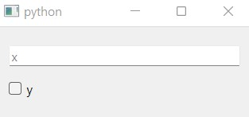

.. _intro:

============
Introduction
============

.. currentmodule:: dawiq

DaWiQ is a Python package for generating Qt widget from the dataclass.

Here is a PySide6 example for widget construction.

.. code-block:: python

    from dataclasses import dataclass
    from dawiq import dataclass2Widget
    from PySide6.QtWidgets import QApplication
    import sys

    @dataclass
    class DataClass:
        x: int
        y: bool

    app = QApplication(sys.argv)
    dataWidget = dataclass2Widget(DataClass)
    dataWidget.show()
    app.exec()
    app.quit()

   Appearance of ``dataWidget``

For other Qt bindings, see the examples in :ref:`user-guide`.

Supported field types
=====================

DaWiQ constructs the widget for each field by using its type hint.
By default, the following types are supported:

* ``Enum`` -> :class:`.EnumComboBox`
* ``bool`` -> :class:`.BoolCheckBox`
* ``Optional[bool]`` -> :class:`.BoolCheckBox` with tristate
* ``int`` -> :class:`.IntLineEdit`
* ``float`` -> :class:`.FloatLineEdit`
* ``str`` -> :class:`.StrLineEdit`
* ``Tuple`` -> :class:`.TupleGroupBox` with nested field widgets
* ``dataclass`` -> Nested :class:`.DataWidget`

How about other types?
----------------------

Any other type can be supported by defining special metadata to the dataclass field:

* ``Qt_typehint``: type hint for widget construction
* ``toQt_converter``: converts custom object to widget data
* ``fromQt_converter``: returns custom object from widget data

For more information, see :ref:`widget` and :ref:`data-model`.

Supported Qt bindings
=====================

DaWiQ is compatible with the following Qt binding packages:

* `PySide6 <https://pypi.org/project/PySide6/>`_
* `PyQt6 <https://pypi.org/project/PyQt6/>`_
* `PySide2 <https://pypi.org/project/PySide2/>`_
* `PyQt5 <https://pypi.org/project/PyQt5/>`_

When DaWiQ is imported, available package is searched and selected in the order mentioned above.
To force a particular API, set environment variable ``DAWIQ_QT_API`` with package name. Letter case does not matter.
