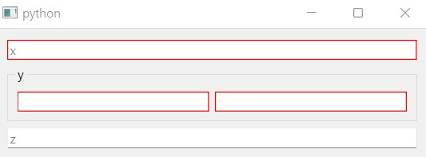

=================================
How to highlight mandatory fields
=================================

.. currentmodule:: dawiq

When we combine the dataclass type with :class:`.DataWidget` by :class:`.DataclassDelegate`, we can distinguish which field is mandatory (no default value) and which widget is empty.
If the widget of the mandatory field is empty, the dataclass instance cannot be generated.

:class:`.DataclassDelegate` automatically sets ``requiresFieldValue`` property to the widget when setting the editor data.
This property indicates if the widget is mandatory but empty, thus requiring the field data.
User can set the style sheet to the application to visualize the required widget.

For example, let us define a dataclass.

.. code-block:: python

    from dataclasses import dataclass
    from typing import Tuple

    @dataclass
    class DataClass:
        x: int
        y: Tuple[float, float]
        z: int = 10

We construct a simple model with one item.

.. tabs::

    .. code-tab:: python
        :caption: PySide6

        from PySide6.QtGui import QStandardItemModel, QStandardItem
        from dawiq import DataclassDelegate

        model = QStandardItemModel()
        item = QStandardItem()
        item.setData(DataClass, role=DataclassDelegate.TypeRole)
        model.appendRow(item)

    .. code-tab:: python
        :caption: PyQt6

        from PyQt6.QtGui import QStandardItemModel, QStandardItem
        from dawiq import DataclassDelegate

        model = QStandardItemModel()
        item = QStandardItem()
        item.setData(DataClass, role=DataclassDelegate.TypeRole)
        model.appendRow(item)

    .. code-tab:: python
        :caption: PySide2

        from PySide2.QtGui import QStandardItemModel, QStandardItem
        from dawiq import DataclassDelegate

        model = QStandardItemModel()
        item = QStandardItem()
        item.setData(DataClass, role=DataclassDelegate.TypeRole)
        model.appendRow(item)

    .. code-tab:: python
        :caption: PyQt5

        from PyQt5.QtGui import QStandardItemModel, QStandardItem
        from dawiq import DataclassDelegate

        model = QStandardItemModel()
        item = QStandardItem()
        item.setData(DataClass, role=DataclassDelegate.TypeRole)
        model.appendRow(item)

Now we construct the delegate and the mapper.

.. code-block:: python

    from dawiq import DataclassMapper

    delegate = DataclassDelegate()
    mapper = DataclassMapper()
    mapper.setItemDelegate(delegate)
    mapper.setModel(model)

Finally we create a dataclass widget, map it to the mapper and display it.
Before running the application, we set the style sheet to :class:`QApplication`.

.. tabs::

    .. code-tab:: python
        :caption: PySide6

        from PySide6.QtWidgets import QApplication
        from dawiq import dataclass2Widget
        import sys

        app = QApplication(sys.argv)
        app.setStyleSheet("*[requiresFieldValue=true]{border: 1px solid red}")

        widget = dataclass2Widget(DataClass)
        mapper.addMapping(widget, 0)
        mapper.setCurrentIndex(0)

        widget.show()
        app.exec()
        app.quit()

    .. code-tab:: python
        :caption: PyQt6

        from PyQt6.QtWidgets import QApplication
        from dawiq import dataclass2Widget
        import sys

        app = QApplication(sys.argv)
        app.setStyleSheet("*[requiresFieldValue=true]{border: 1px solid red}")

        widget = dataclass2Widget(DataClass)
        mapper.addMapping(widget, 0)
        mapper.setCurrentIndex(0)

        widget.show()
        app.exec()
        app.quit()

    .. code-tab:: python
        :caption: PySide2

        from PySide2.QtWidgets import QApplication
        from dawiq import dataclass2Widget
        import sys

        app = QApplication(sys.argv)
        app.setStyleSheet("*[requiresFieldValue=true]{border: 1px solid red}")

        widget = dataclass2Widget(DataClass)
        mapper.addMapping(widget, 0)
        mapper.setCurrentIndex(0)

        widget.show()
        app.exec_()
        app.quit()

    .. code-tab:: python
        :caption: PyQt5

        from PyQt5.QtWidgets import QApplication
        from dawiq import dataclass2Widget
        import sys

        app = QApplication(sys.argv)
        app.setStyleSheet("*[requiresFieldValue=true]{border: 1px solid red}")

        widget = dataclass2Widget(DataClass)
        mapper.addMapping(widget, 0)
        mapper.setCurrentIndex(0)

        widget.show()
        app.exec()
        app.quit()

Below is the image of the resulting widget.
Required fields are marked with red boundaries, which are gone when we fill the value.

   Widget with highlighted fields
