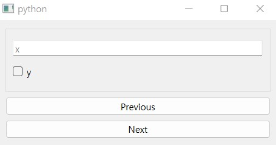
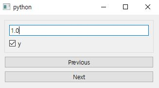
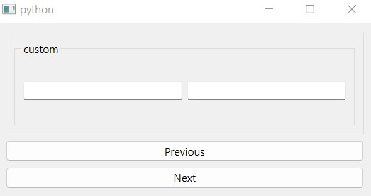

.. _data-model:

=====================
How to use item model
=====================

.. currentmodule:: dawiq

:class:`.DataWidget` can be synced with item model by using :class:`.DataclassDelegate` and :class:`.DataclassMapper`.

:class:`.DataclassDelegate` defines two types of data:

* Dataclass **type**: stored with :attr:`.DataclassDelegate.TypeRole`
* Dataclass **data**: stored with :attr:`.DataclassDelegate.DataRole` as :class:`dict`

To get the dataclass instance, user can retrieve these values from the model item and construct it.
:ref:`construct-dataclass` document covers that topic.

As explained in :ref:`widget`, the field type can be different from the widget data type.
In this case we need to define the unary callable converters as the metadata of the field.

* ``toQt_converter``: field data -> widget data
* ``fromQt_converter``: widget data -> field data

Basic example
=============

This is the basic example without data converter.
First we define a simple dataclass.

.. code-block:: python

    from dataclasses import dataclass

    @dataclass
    class DataClass:
        x: float = 1.0
        y: bool = True

Then we construct a model with two items, each storing the dataclass type which will be detected by the delegate.

.. tabs::

    .. code-tab:: python
        :caption: PySide6

        from PySide6.QtGui import QStandardItemModel, QStandardItem
        from dawiq import DataclassDelegate

        model = QStandardItemModel()
        for _ in range(2):
            item = QStandardItem()
            item.setData(DataClass, role=DataclassDelegate.TypeRole)
            model.appendRow(item)

    .. code-tab:: python
        :caption: PyQt6

        from PyQt6.QtGui import QStandardItemModel, QStandardItem
        from dawiq import DataclassDelegate

        model = QStandardItemModel()
        for _ in range(2):
            item = QStandardItem()
            item.setData(DataClass, role=DataclassDelegate.TypeRole)
            model.appendRow(item)

    .. code-tab:: python
        :caption: PySide2

        from PySide2.QtGui import QStandardItemModel, QStandardItem
        from dawiq import DataclassDelegate

        model = QStandardItemModel()
        for _ in range(2):
            item = QStandardItem()
            item.setData(DataClass, role=DataclassDelegate.TypeRole)
            model.appendRow(item)

    .. code-tab:: python
        :caption: PyQt5

        from PyQt5.QtGui import QStandardItemModel, QStandardItem
        from dawiq import DataclassDelegate

        model = QStandardItemModel()
        for _ in range(2):
            item = QStandardItem()
            item.setData(DataClass, role=DataclassDelegate.TypeRole)
            model.appendRow(item)

Now we construct the delegate and the mapper.

.. code-block:: python

    from dawiq import DataclassMapper

    delegate = DataclassDelegate()
    mapper = DataclassMapper()
    mapper.setItemDelegate(delegate)
    mapper.setModel(model)

Finally we create a widget, map it to the mapper and display it.
The widget consists of:

* Data widget from ``DataClass``
* Buttons to change the model index

.. tabs::

    .. code-tab:: python
        :caption: PySide6

        from PySide6.QtWidgets import QApplication, QWidget, QVBoxLayout, QPushButton
        from dawiq import dataclass2Widget
        import sys

        app = QApplication(sys.argv)

        widget = QWidget()
        widget.setLayout(QVBoxLayout())
        dataWidget = dataclass2Widget(DataClass)
        widget.layout().addWidget(dataWidget)
        btn1 = QPushButton("Previous")
        widget.layout().addWidget(btn1)
        btn2 = QPushButton("Next")
        widget.layout().addWidget(btn2)

        btn1.clicked.connect(mapper.toPrevious)
        btn2.clicked.connect(mapper.toNext)

        mapper.addMapping(dataWidget, 0)
        mapper.setCurrentIndex(0)

        widget.show()
        app.exec()
        app.quit()

    .. code-tab:: python
        :caption: PyQt6

        from PyQt6.QtWidgets import QApplication, QWidget, QVBoxLayout, QPushButton
        from dawiq import dataclass2Widget
        import sys

        app = QApplication(sys.argv)

        widget = QWidget()
        widget.setLayout(QVBoxLayout())
        dataWidget = dataclass2Widget(DataClass)
        widget.layout().addWidget(dataWidget)
        btn1 = QPushButton("Previous")
        widget.layout().addWidget(btn1)
        btn2 = QPushButton("Next")
        widget.layout().addWidget(btn2)

        btn1.clicked.connect(mapper.toPrevious)
        btn2.clicked.connect(mapper.toNext)

        mapper.addMapping(dataWidget, 0)
        mapper.setCurrentIndex(0)

        widget.show()
        app.exec()
        app.quit()

    .. code-tab:: python
        :caption: PySide2

        from PySide2.QtWidgets import QApplication, QWidget, QVBoxLayout, QPushButton
        from dawiq import dataclass2Widget
        import sys

        app = QApplication(sys.argv)

        widget = QWidget()
        widget.setLayout(QVBoxLayout())
        dataWidget = dataclass2Widget(DataClass)
        widget.layout().addWidget(dataWidget)
        btn1 = QPushButton("Previous")
        widget.layout().addWidget(btn1)
        btn2 = QPushButton("Next")
        widget.layout().addWidget(btn2)

        btn1.clicked.connect(mapper.toPrevious)
        btn2.clicked.connect(mapper.toNext)

        mapper.addMapping(dataWidget, 0)
        mapper.setCurrentIndex(0)

        widget.show()
        app.exec_()
        app.quit()

    .. code-tab:: python
        :caption: PyQt5

        from PyQt5.QtWidgets import QApplication, QWidget, QVBoxLayout, QPushButton
        from dawiq import dataclass2Widget
        import sys

        app = QApplication(sys.argv)

        widget = QWidget()
        widget.setLayout(QVBoxLayout())
        dataWidget = dataclass2Widget(DataClass)
        widget.layout().addWidget(dataWidget)
        btn1 = QPushButton("Previous")
        widget.layout().addWidget(btn1)
        btn2 = QPushButton("Next")
        widget.layout().addWidget(btn2)

        btn1.clicked.connect(mapper.toPrevious)
        btn2.clicked.connect(mapper.toNext)

        mapper.addMapping(dataWidget, 0)
        mapper.setCurrentIndex(0)

        widget.show()
        app.exec()
        app.quit()

Below is the image of the resulting widget.
Try change the model index and the editor data, and see if the data is stored and read correctly.

   Widget with model

Default value example
=====================

In the previous example, the dataclass defines default value but the widget is still empty.
It is because default value is not updated to the model and to the empty widget, in order to distinguish the intensional empty input by the user.

To make default values applied to missing fields, set :meth:`.DataclassDelegate.ignoreMissing` to ``False``.

.. code-block:: python

    from dawiq import DataclassMapper

    delegate = DataclassDelegate()
    delegate.setIgnoreMissing(False)
    mapper = DataclassMapper()
    mapper.setItemDelegate(delegate)
    mapper.setModel(model)

   Widget with default value used for missing field

Data converter example
======================

In this example, we define the data converters for ``CustomClass``, which we used in :ref:`Specifying type hint <type-hint>`.

.. code-block:: python

    from dataclasses import dataclass, field
    from typing import Tuple

    class CustomClass:
        def __init__(self, x: int, y: int):
            self.x = x
            self.y = y

    @dataclass
    class DataClass:
        custom: CustomClass = field(metadata=dict(
            Qt_typehint=Tuple[int, int],
            toQt_converter=lambda obj: (obj.x, obj.y),
            fromQt_converter=lambda args: CustomClass(*args),
        ))

   Widget with model compatible to custom type

Tuple from the field widget is converted to ``CustomClass`` before being stored in the model, and ``CustomClass`` from the model is converted to the tuple and displayed on the widget.
