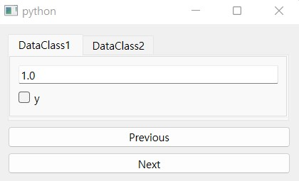
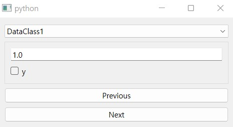

.. _multi-dcls:

===================================
How to use multiple dataclass types
===================================

.. currentmodule:: dawiq

In :ref:`data-model` example, every item of the model had the same dataclass type and we could only change its data value.
In this guide, we will go further to modify the dataclass type as well.

When the dataclass type changes, data widget for the item must also change.
:class:`.DataclassDelegate` and :class:`.DataclassMapper` can be combined with :class:`.DataclassStackedWidget` or :class:`.DataclassTabWidget` to synchronize the widget with the data type.

.. _multi-dcls-basic:

Basic example
=============

In this example, we create a widget which consists of:

* :class:`.DataclassTabWidget` to display and choose the dataclass type
* Buttons to change the model index

We first define the dataclasses.

.. code-block:: python

    from dataclasses import dataclass

    @dataclass
    class DataClass1:
        x: float
        y: bool

    @dataclass
    class DataClass2:
        x: float
        y: int

Note that the two dataclasses partially share their fields.
When the data widget changes, values of the common fields in the model data will be updated to the new widget.

Then we construct the widget with basic API, and add the dataclass types.

.. tabs::

    .. code-tab:: python
        :caption: PySide6

        from PySide6.QtWidgets import QApplication, QWidget, QVBoxLayout, QPushButton
        from PySide6.QtCore import Signal
        from dawiq import DataclassTabWidget, dataclass2Widget
        import sys

        app = QApplication(sys.argv)

        class MyWidget(QWidget):

            toPrevious = Signal()
            toNext = Signal()

            def __init__(self, parent=None):
                super().__init__(parent)

                self.setLayout(QVBoxLayout())

                self.tabWidget = DataclassTabWidget()
                self.layout().addWidget(self.tabWidget)

                self.btn1 = QPushButton("Previous")
                self.btn2 = QPushButton("Next")
                self.layout().addWidget(self.btn1)
                self.layout().addWidget(self.btn2)

                self.btn1.clicked.connect(self.toPrevious)
                self.btn2.clicked.connect(self.toNext)

            def addDataclass(self, dcls):
                self.tabWidget.addDataWidget(dataclass2Widget(dcls), dcls, dcls.__name__)

        myWidget = MyWidget()

        for dcls in [DataClass1, DataClass2]:
            myWidget.addDataclass(dcls)

    .. code-tab:: python
        :caption: PyQt6

        from PyQt6.QtWidgets import QApplication, QWidget, QVBoxLayout, QPushButton
        from PyQt6.QtCore import pyqtSignal
        from dawiq import DataclassTabWidget, dataclass2Widget
        import sys

        app = QApplication(sys.argv)

        class MyWidget(QWidget):

            toPrevious = pyqtSignal()
            toNext = pyqtSignal()

            def __init__(self, parent=None):
                super().__init__(parent)

                self.setLayout(QVBoxLayout())

                self.tabWidget = DataclassTabWidget()
                self.layout().addWidget(self.tabWidget)

                self.btn1 = QPushButton("Previous")
                self.btn2 = QPushButton("Next")
                self.layout().addWidget(self.btn1)
                self.layout().addWidget(self.btn2)

                self.btn1.clicked.connect(self.toPrevious)
                self.btn2.clicked.connect(self.toNext)

            def addDataclass(self, dcls):
                self.tabWidget.addDataWidget(dataclass2Widget(dcls), dcls, dcls.__name__)

        myWidget = MyWidget()

        for dcls in [DataClass1, DataClass2]:
            myWidget.addDataclass(dcls)

    .. code-tab:: python
        :caption: PySide2

        from PySide2.QtWidgets import QApplication, QWidget, QVBoxLayout, QPushButton
        from PySide2.QtCore import Signal
        from dawiq import DataclassTabWidget, dataclass2Widget
        import sys

        app = QApplication(sys.argv)

        class MyWidget(QWidget):

            toPrevious = Signal()
            toNext = Signal()

            def __init__(self, parent=None):
                super().__init__(parent)

                self.setLayout(QVBoxLayout())

                self.tabWidget = DataclassTabWidget()
                self.layout().addWidget(self.tabWidget)

                self.btn1 = QPushButton("Previous")
                self.btn2 = QPushButton("Next")
                self.layout().addWidget(self.btn1)
                self.layout().addWidget(self.btn2)

                self.btn1.clicked.connect(self.toPrevious)
                self.btn2.clicked.connect(self.toNext)

            def addDataclass(self, dcls):
                self.tabWidget.addDataWidget(dataclass2Widget(dcls), dcls, dcls.__name__)

        myWidget = MyWidget()

        for dcls in [DataClass1, DataClass2]:
            myWidget.addDataclass(dcls)

    .. code-tab:: python
        :caption: PyQt5

        from PyQt5.QtWidgets import QApplication, QWidget, QVBoxLayout, QPushButton
        from PyQt5.QtCore import pyqtSignal
        from dawiq import DataclassTabWidget, dataclass2Widget
        import sys

        app = QApplication(sys.argv)

        class MyWidget(QWidget):

            toPrevious = pyqtSignal()
            toNext = pyqtSignal()

            def __init__(self, parent=None):
                super().__init__(parent)

                self.setLayout(QVBoxLayout())

                self.tabWidget = DataclassTabWidget()
                self.layout().addWidget(self.tabWidget)

                self.btn1 = QPushButton("Previous")
                self.btn2 = QPushButton("Next")
                self.layout().addWidget(self.btn1)
                self.layout().addWidget(self.btn2)

                self.btn1.clicked.connect(self.toPrevious)
                self.btn2.clicked.connect(self.toNext)

            def addDataclass(self, dcls):
                self.tabWidget.addDataWidget(dataclass2Widget(dcls), dcls, dcls.__name__)

        myWidget = MyWidget()

        for dcls in [DataClass1, DataClass2]:
            myWidget.addDataclass(dcls)

Now we construct a model with two items, each having different data types.

.. tabs::

    .. code-tab:: python
        :caption: PySide6

        from PySide6.QtGui import QStandardItemModel, QStandardItem
        from dawiq import DataclassDelegate

        model = QStandardItemModel()
        for dcls in [DataClass1, DataClass2]:
            item = QStandardItem()
            item.setData(dcls, role=DataclassDelegate.TypeRole)
            model.appendRow(item)

    .. code-tab:: python
        :caption: PyQt6

        from PyQt6.QtGui import QStandardItemModel, QStandardItem
        from dawiq import DataclassDelegate

        model = QStandardItemModel()
        for dcls in [DataClass1, DataClass2]:
            item = QStandardItem()
            item.setData(dcls, role=DataclassDelegate.TypeRole)
            model.appendRow(item)

    .. code-tab:: python
        :caption: PySide2

        from PySide2.QtGui import QStandardItemModel, QStandardItem
        from dawiq import DataclassDelegate

        model = QStandardItemModel()
        for dcls in [DataClass1, DataClass2]:
            item = QStandardItem()
            item.setData(dcls, role=DataclassDelegate.TypeRole)
            model.appendRow(item)

    .. code-tab:: python
        :caption: PyQt5

        from PyQt5.QtGui import QStandardItemModel, QStandardItem
        from dawiq import DataclassDelegate

        model = QStandardItemModel()
        for dcls in [DataClass1, DataClass2]:
            item = QStandardItem()
            item.setData(dcls, role=DataclassDelegate.TypeRole)
            model.appendRow(item)

Finally we construct the delegate and the mapper, and set up the system.

.. code-block:: python

    from dawiq import DataclassDelegate, DataclassMapper

    delegate = DataclassDelegate()
    mapper = DataclassMapper()
    mapper.setItemDelegate(delegate)
    mapper.setModel(model)
    myWidget.toPrevious.connect(mapper.toPrevious)
    myWidget.toNext.connect(mapper.toNext)

    mapper.addMapping(myWidget.tabWidget, 0)
    mapper.setCurrentIndex(0)

Now let's set the data and display the widget.

.. tabs::

    .. code-tab:: python
        :caption: PySide6

        model.setData(model.index(0, 0), dict(x=1.0), delegate.DataRole)
        model.setData(model.index(1, 0), dict(y=2), delegate.DataRole)

        myWidget.show()
        app.exec()
        app.quit()

    .. code-tab:: python
        :caption: PyQt6

        model.setData(model.index(0, 0), dict(x=1.0), delegate.DataRole)
        model.setData(model.index(1, 0), dict(y=2), delegate.DataRole)

        myWidget.show()
        app.exec()
        app.quit()

    .. code-tab:: python
        :caption: PySide2

        model.setData(model.index(0, 0), dict(x=1.0), delegate.DataRole)
        model.setData(model.index(1, 0), dict(y=2), delegate.DataRole)

        myWidget.show()
        app.exec_()
        app.quit()

    .. code-tab:: python
        :caption: PyQt5

        model.setData(model.index(0, 0), dict(x=1.0), delegate.DataRole)
        model.setData(model.index(1, 0), dict(y=2), delegate.DataRole)

        myWidget.show()
        app.exec()
        app.quit()

   Widget with dataclass tab widget

Try change the dataclass type, set the data and switch the model index.

Custom widget example
=====================

In this example, we will define a custom widget to select the dataclass instead of using :class:`.DataclassTabWidget`.
The widget consists of:

* :class:`QComboBox` to select the dataclass type
* :class:`.DataclassStackedWidget` to display the dataclass data
* Buttons to change the model index

Dataclasses are same to :ref:`multi-dcls-basic`, so we go directly to widget construction.

.. tabs::

    .. code-tab:: python
        :caption: PySide6

        from PySide6.QtWidgets import QApplication, QWidget, QVBoxLayout, QComboBox, QPushButton
        from PySide6.QtCore import Signal
        from dawiq import DataclassStackedWidget, dataclass2Widget
        import sys

        app = QApplication(sys.argv)

        class MyWidget(QWidget):

            toPrevious = Signal()
            toNext = Signal()

            def __init__(self, parent=None):
                super().__init__(parent)

                self.setLayout(QVBoxLayout())

                self.comboBox = QComboBox()
                self.comboBox.setPlaceholderText("Select dataclass type")
                self.layout().addWidget(self.comboBox)

                self.stackedWidget = DataclassStackedWidget()
                self.layout().addWidget(self.stackedWidget)

                self.btn1 = QPushButton("Previous")
                self.btn2 = QPushButton("Next")
                self.layout().addWidget(self.btn1)
                self.layout().addWidget(self.btn2)

                self.btn1.clicked.connect(self.toPrevious)
                self.btn2.clicked.connect(self.toNext)

            def addDataclass(self, dcls):
                self.comboBox.addItem(dcls.__name__, dcls)
                self.stackedWidget.addDataWidget(dataclass2Widget(dcls), dcls)

        myWidget = MyWidget()

        for dcls in [DataClass1, DataClass2]:
            myWidget.addDataclass(dcls)

    .. code-tab:: python
        :caption: PyQt6

        from PyQt6.QtWidgets import QApplication, QWidget, QVBoxLayout, QComboBox, QPushButton
        from PyQt6.QtCore import pyqtSignal
        from dawiq import DataclassStackedWidget, dataclass2Widget
        import sys

        app = QApplication(sys.argv)

        class MyWidget(QWidget):

            toPrevious = pyqtSignal()
            toNext = pyqtSignal()

            def __init__(self, parent=None):
                super().__init__(parent)

                self.setLayout(QVBoxLayout())

                self.comboBox = QComboBox()
                self.comboBox.setPlaceholderText("Select dataclass type")
                self.layout().addWidget(self.comboBox)

                self.stackedWidget = DataclassStackedWidget()
                self.layout().addWidget(self.stackedWidget)

                self.btn1 = QPushButton("Previous")
                self.btn2 = QPushButton("Next")
                self.layout().addWidget(self.btn1)
                self.layout().addWidget(self.btn2)

                self.btn1.clicked.connect(self.toPrevious)
                self.btn2.clicked.connect(self.toNext)

            def addDataclass(self, dcls):
                self.comboBox.addItem(dcls.__name__, dcls)
                self.stackedWidget.addDataWidget(dataclass2Widget(dcls), dcls)

        myWidget = MyWidget()

        for dcls in [DataClass1, DataClass2]:
            myWidget.addDataclass(dcls)

    .. code-tab:: python
        :caption: PySide2

        from PySide2.QtWidgets import QApplication, QWidget, QVBoxLayout, QComboBox, QPushButton
        from PySide2.QtCore import Signal
        from dawiq import DataclassStackedWidget, dataclass2Widget
        import sys

        app = QApplication(sys.argv)

        class MyWidget(QWidget):

            toPrevious = Signal()
            toNext = Signal()

            def __init__(self, parent=None):
                super().__init__(parent)

                self.setLayout(QVBoxLayout())

                self.comboBox = QComboBox()
                self.comboBox.setPlaceholderText("Select dataclass type")
                self.layout().addWidget(self.comboBox)

                self.stackedWidget = DataclassStackedWidget()
                self.layout().addWidget(self.stackedWidget)

                self.btn1 = QPushButton("Previous")
                self.btn2 = QPushButton("Next")
                self.layout().addWidget(self.btn1)
                self.layout().addWidget(self.btn2)

                self.btn1.clicked.connect(self.toPrevious)
                self.btn2.clicked.connect(self.toNext)

            def addDataclass(self, dcls):
                self.comboBox.addItem(dcls.__name__, dcls)
                self.stackedWidget.addDataWidget(dataclass2Widget(dcls), dcls)

        myWidget = MyWidget()

        for dcls in [DataClass1, DataClass2]:
            myWidget.addDataclass(dcls)

    .. code-tab:: python
        :caption: PyQt5

        from PyQt5.QtWidgets import QApplication, QWidget, QVBoxLayout, QComboBox, QPushButton
        from PyQt5.QtCore import pyqtSignal
        from dawiq import DataclassStackedWidget, dataclass2Widget
        import sys

        app = QApplication(sys.argv)

        class MyWidget(QWidget):

            toPrevious = pyqtSignal()
            toNext = pyqtSignal()

            def __init__(self, parent=None):
                super().__init__(parent)

                self.setLayout(QVBoxLayout())

                self.comboBox = QComboBox()
                self.comboBox.setPlaceholderText("Select dataclass type")
                self.layout().addWidget(self.comboBox)

                self.stackedWidget = DataclassStackedWidget()
                self.layout().addWidget(self.stackedWidget)

                self.btn1 = QPushButton("Previous")
                self.btn2 = QPushButton("Next")
                self.layout().addWidget(self.btn1)
                self.layout().addWidget(self.btn2)

                self.btn1.clicked.connect(self.toPrevious)
                self.btn2.clicked.connect(self.toNext)

            def addDataclass(self, dcls):
                self.comboBox.addItem(dcls.__name__, dcls)
                self.stackedWidget.addDataWidget(dataclass2Widget(dcls), dcls)

        myWidget = MyWidget()

        for dcls in [DataClass1, DataClass2]:
            myWidget.addDataclass(dcls)

We need to define a delegate so that it can synchronize ``DataclassStackedWidget`` and ``QComboBox``.

.. code-block:: python

    from dawiq import DataclassDelegate

    class MyDelegate(DataclassDelegate):

        def setModelData(self, editor, model, index):
            if isinstance(editor, MyWidget):
                dcls = editor.comboBox.currentData()
                model.setData(index, dcls, role=self.TypeRole)
                self.setModelData(editor.stackedWidget, model, index)
            super().setModelData(editor, model, index)

        def setEditorData(self, editor, index):
            if isinstance(editor, MyWidget):
                modeldata = index.data(role=self.TypeRole)
                editor.comboBox.setCurrentIndex(editor.comboBox.findData(modeldata))
                self.setEditorData(editor.stackedWidget, index)
            super().setEditorData(editor, index)

    delegate = MyDelegate()

Now we construct a model with two items, each having different data types.

.. tabs::

    .. code-tab:: python
        :caption: PySide6

        from PySide6.QtGui import QStandardItemModel, QStandardItem

        model = QStandardItemModel()
        for dcls in [DataClass1, DataClass2]:
            item = QStandardItem()
            item.setData(dcls, role=delegate.TypeRole)
            model.appendRow(item)

    .. code-tab:: python
        :caption: PyQt6

        from PyQt6.QtGui import QStandardItemModel, QStandardItem

        model = QStandardItemModel()
        for dcls in [DataClass1, DataClass2]:
            item = QStandardItem()
            item.setData(dcls, role=delegate.TypeRole)
            model.appendRow(item)

    .. code-tab:: python
        :caption: PySide2

        from PySide2.QtGui import QStandardItemModel, QStandardItem

        model = QStandardItemModel()
        for dcls in [DataClass1, DataClass2]:
            item = QStandardItem()
            item.setData(dcls, role=delegate.TypeRole)
            model.appendRow(item)

    .. code-tab:: python
        :caption: PyQt5

        from PyQt5.QtGui import QStandardItemModel, QStandardItem

        model = QStandardItemModel()
        for dcls in [DataClass1, DataClass2]:
            item = QStandardItem()
            item.setData(dcls, role=delegate.TypeRole)
            model.appendRow(item)

We also need to define a mapper so that whenever the combo box index changes the model will get updated too.

.. code-block:: python

    from dawiq import DataclassMapper

    class MyMapper(DataclassMapper):
        def addMapping(self, widget, section, propertyname=b""):
            if isinstance(widget, MyWidget):
                widget.comboBox.activated.connect(self.submit)
                widget.stackedWidget.currentDataEdited.connect(self.submit)
            super().addMapping(widget, section, propertyname)

    mapper = MyMapper()

Finally we set up the system.

.. code-block:: python

    mapper.setItemDelegate(delegate)
    mapper.setModel(model)
    myWidget.toPrevious.connect(mapper.toPrevious)
    myWidget.toNext.connect(mapper.toNext)

    mapper.addMapping(myWidget, 0)
    mapper.setCurrentIndex(0)

Now let's set the data and display the widget.

.. tabs::

    .. code-tab:: python
        :caption: PySide6

        model.setData(model.index(0, 0), dict(x=1.0), delegate.DataRole)
        model.setData(model.index(1, 0), dict(y=2), delegate.DataRole)

        myWidget.show()
        app.exec()
        app.quit()

    .. code-tab:: python
        :caption: PyQt6

        model.setData(model.index(0, 0), dict(x=1.0), delegate.DataRole)
        model.setData(model.index(1, 0), dict(y=2), delegate.DataRole)

        myWidget.show()
        app.exec()
        app.quit()

    .. code-tab:: python
        :caption: PySide2

        model.setData(model.index(0, 0), dict(x=1.0), delegate.DataRole)
        model.setData(model.index(1, 0), dict(y=2), delegate.DataRole)

        myWidget.show()
        app.exec_()
        app.quit()

    .. code-tab:: python
        :caption: PyQt5

        model.setData(model.index(0, 0), dict(x=1.0), delegate.DataRole)
        model.setData(model.index(1, 0), dict(y=2), delegate.DataRole)

        myWidget.show()
        app.exec()
        app.quit()

   Custom widget with dataclass selection
