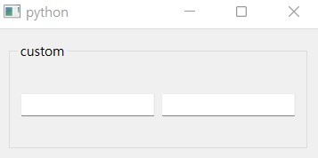

===============
Creating widget
===============

.. currentmodule:: dawiq

:func:`.dataclass2Widget` constructs :class:`.DataWidget` from dataclass.

Basic example
=============

Here is a reproducible code for the example in :ref:`intro` page.
First, let's define a simple dataclass.

.. code-block:: python

    from dataclasses import dataclass

    @dataclass
    class DataClass:
        x: int
        y: bool

We then create a widget and display it.

.. tabs::

    .. code-tab:: python
        :caption: PySide6

        from PySide6.QtWidgets import QApplication
        from dawiq import dataclass2Widget
        import sys

        app = QApplication(sys.argv)
        dataWidget = dataclass2Widget(DataClass)
        dataWidget.show()
        app.exec()
        app.quit()

    .. code-tab:: python
        :caption: PyQt6

        from PyQt6.QtWidgets import QApplication
        from dawiq import dataclass2Widget
        import sys

        app = QApplication(sys.argv)
        dataWidget = dataclass2Widget(DataClass)
        dataWidget.show()
        app.exec()
        app.quit()

    .. code-tab:: python
        :caption: PySide2

        from PySide2.QtWidgets import QApplication
        from dawiq import dataclass2Widget
        import sys

        app = QApplication(sys.argv)
        dataWidget = dataclass2Widget(DataClass)
        dataWidget.show()
        app.exec_()
        app.quit()

    .. code-tab:: python
        :caption: PyQt5

        from PyQt5.QtWidgets import QApplication
        from dawiq import dataclass2Widget
        import sys

        app = QApplication(sys.argv)
        dataWidget = dataclass2Widget(DataClass)
        dataWidget.show()
        app.exec()
        app.quit()

Your widget will look like this:

.. figure:: ../_images/widget-example.jpg
   :align: center

   Widget with :class:`.IntLineEdit` and :class:`.BoolCheckBox`

Nested dataclass
================

Nested dataclass is supported by nested widget.

.. code-block:: python

    from dataclasses import dataclass

    @dataclass
    class Inner:
        a: int

    @dataclass
    class DataClass:
        x: bool
        y: Inner

   Widget with :class:`.BoolCheckBox` and nested :class:`.DataWidget`

Specifying type hint
====================

If the type hint of your field is not supported by :func:`.type2Widget`, you can specify the alternative type hint by setting ``Qt_typehint`` metadata.

The following example defines a dataclass with a field of both :class:`int` and :class:`float`.
The widget constructed from it, however, treats the field as :class:`float`.

.. code-block:: python

    from dataclasses import dataclass, field
    from typing import Union

    @dataclass
    class DataClass:
        x: Union[int, float] = field(metadata=dict(Qt_typehint=float))

.. figure:: ../_images/typehint-example.jpg
   :align: center

   Widget with :class:`.FloatLineEdit`

This feature can be used to construct a widget for a custom type.
Here, we define ``CustomClass`` which takes two integers as parameters.
By passing ``Tuple[int, int]`` to ``Qt_typehint``, a widget for its arguments can be constructed.

.. code-block:: python

    from dataclasses import dataclass, field
    from typing import Tuple

    class CustomClass:
        def __init__(self, x, y):
            ...

    @dataclass
    class DataClass:
        custom: CustomClass = field(metadata=dict(Qt_typehint=Tuple[int, int]))

   Widget with :class:`.TupleGroupBox` with two :class:`.IntLineEdit`

When setting or retrieving the data from this widget, other metadata are required to convert ``CustomClass`` to ``Tuple[int, int]`` and vice versa.
It is explained in :ref:`data-model` page.

Defining field widget
=====================

If you want a different widget to represent your field, you can define your custom field widget.
Field widget must have the structure of :class:`FieldWidgetProtocol <.typing.FieldWidgetProtocol>`.

Once you defined your field widget, define a function which replaces :func:`type2Widget` and pass it to :func:`dataclass2Widget` when constructing the data widget.
